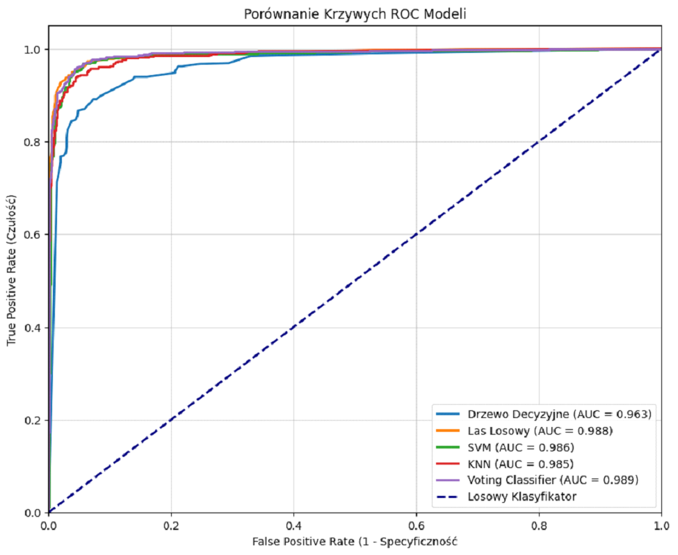
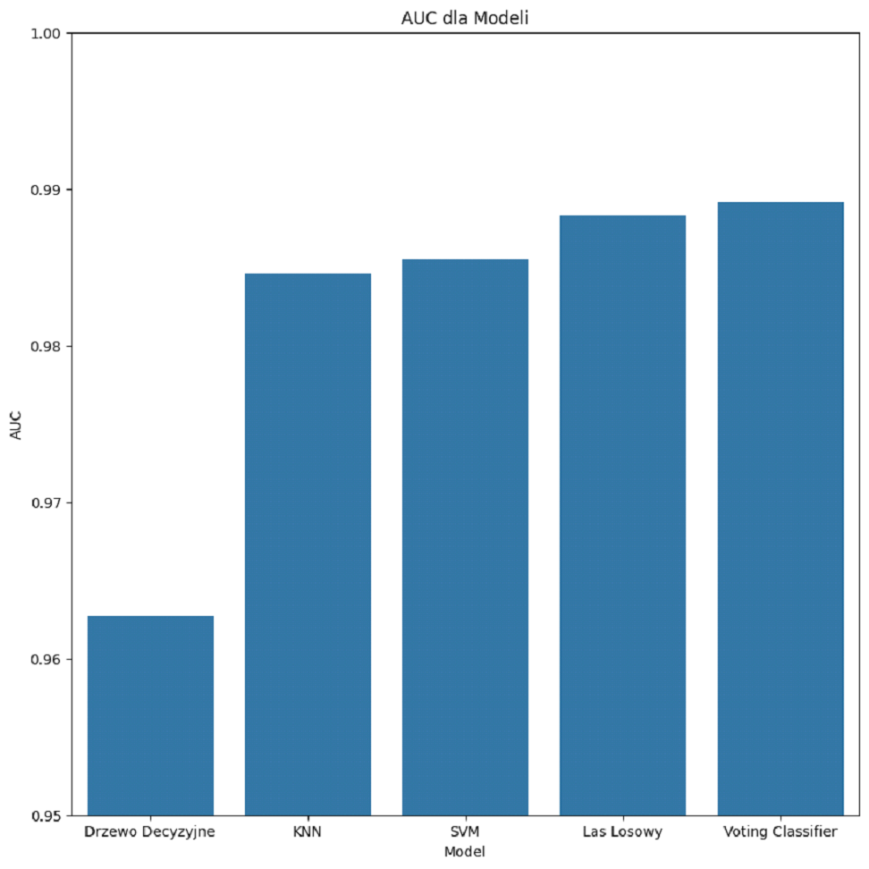
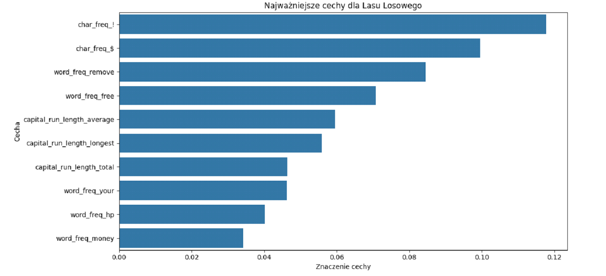

# Spam Classification

Binary classification of email messages as spam or ham (legitimate email),
based on word and character frequency features extracted from the email body.


*All 5 models after hyperparameter tuning - VotingClassifier achieved the highest AUC (0.9891)*

---

## Authors

5-person team project - SGGW, course: Metody Analizy Danych.

| Name | GitHub |
|------|--------|
| Jakub Rosa | [PogchampMuffin3](https://github.com/PogchampMuffin3)|
| Artur Nejmanowski | [arturn0](https://github.com/arturn0)|
| Hubert Murawski | [ulan9007](https://github.com/ulan9007)|
| Dawid Stasiak | [Dawidks294](https://github.com/Dawidks294)|
| Wojciech Seńko | [wojsen](https://github.com/wojsen)|

> The project was developed collaboratively outside of a version control system.  
> The notebook is written in Polish.

---

## Dataset

UCI Spambase dataset (1999) - included in `data/spambase.data`.

| Property | Value |
|----------|-------|
| Records | 4 601 |
| Features | 57 (word frequencies, character frequencies, capital letter statistics) |
| Target | `spam`: `1` = spam, `0` = ham |
| Missing values | None |
| Source | [UCI ML Repository - Spambase](https://archive.ics.uci.edu/dataset/94/spambase) |

**Feature groups:**
- `word_freq_*` - frequency of 48 specific words as % of total words
- `char_freq_*` - frequency of 6 special characters as % of total characters
- `capital_run_length_*` - average, longest and total length of capital letter sequences

---

## Method

1. **Exploratory data analysis** - distributions, descriptive statistics, outlier detection
2. **Preprocessing** - log1p transformation to reduce right skew; `StandardScaler` normalisation (required for KNN and SVM)
3. **Train/test split** - 70% training / 30% test
4. **Models trained and compared:**
   - Decision Tree (CART)
   - Random Forest
   - Support Vector Machine (SVM)
   - K-Nearest Neighbors (KNN)
   - VotingClassifier (ensemble of all four above)
5. **Hyperparameter tuning** - cross-validated grid search; AUC used as the primary optimisation metric
6. **Validation** - 5-fold cross-validation for all models

---

## Results

### Model performance (after tuning)

| Model | Accuracy | F1 Score | AUC |
|-------|----------|----------|-----|
| Decision Tree | 91.2% | 0.890 | 0.963 |
| KNN | 93.4% | 0.920 | 0.974 |
| SVM | 95.0% | 0.940 | 0.986 |
| Random Forest | **95.7%** | **0.948** | 0.988 |
| **VotingClassifier** | 95.2% | 0.942 | **0.989** |

### 5-fold cross-validation AUC

| Model | Mean AUC | Std |
|-------|---------|-----|
| Decision Tree | 0.9435 | ±0.033 |
| KNN | 0.9635 | ±0.030 |
| SVM | 0.9693 | ±0.027 |
| Random Forest | 0.9696 | ±0.032 |
| **VotingClassifier** | **0.9732** | **±0.026** |

VotingClassifier achieved the highest AUC - both on the test set and in cross-validation - confirming its superior ability to separate spam from ham.

---

## Key Findings

### Best model
The **VotingClassifier** (ensemble of Decision Tree, Random Forest, SVM and KNN) achieved the best AUC (0.9891) with the lowest cross-validation variance (±0.026), indicating stable generalisation. Random Forest had the highest raw accuracy and F1 score.

### Algorithm comparison

| Model | Strengths | Weaknesses |
|-------|-----------|------------|
| Decision Tree | Interpretable; visualisable tree structure | Lowest AUC; prone to overfitting |
| Random Forest | Best accuracy and F1 | Slower inference |
| SVM | Strong AUC; robust to high-dimensional data | No native feature importance |
| KNN | Simple; no training phase | Sensitive to scale; slow on large datasets |
| VotingClassifier | Best AUC; most stable | Most computationally expensive |

### Feature importance
Top spam predictors (tree-based model analysis):

1. **`char_freq_$`** - dollar sign frequency; strongest single predictor
2. **`word_freq_remove`** - presence of "remove" (unsubscribe language)
3. **`char_freq_!`** - exclamation mark frequency
4. **`word_freq_free`** - presence of "free"
5. **`capital_run_length_average`** - aggressive use of capitals in spam

### Practical example
All models except the untuned Decision Tree correctly classified a lottery scam email as spam and a film festival invitation as ham.

---

## Visualisations

### AUC comparison



### ROC curves (all models)


### Feature importance - Random Forest



---

## Requirements

```bash
pip install -r requirements.txt
```

---

## Usage

```bash
jupyter notebook spam_classification.ipynb
```

The dataset is included in `data/spambase.data`

---

## Report

Full methodology and analysis: [`docs/raport.pdf`](docs/raport.pdf)
